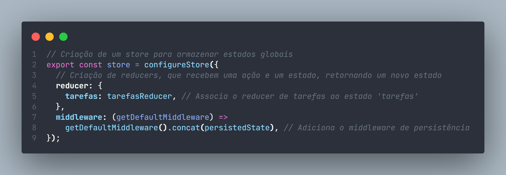
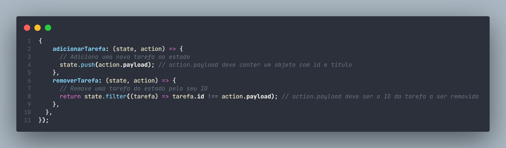
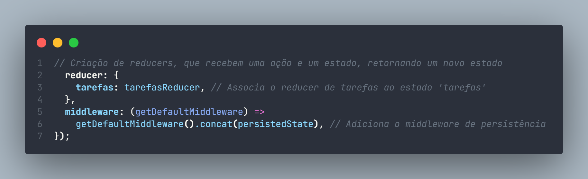
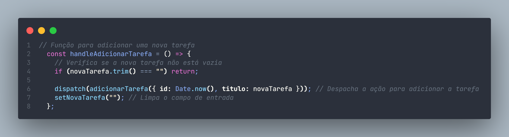
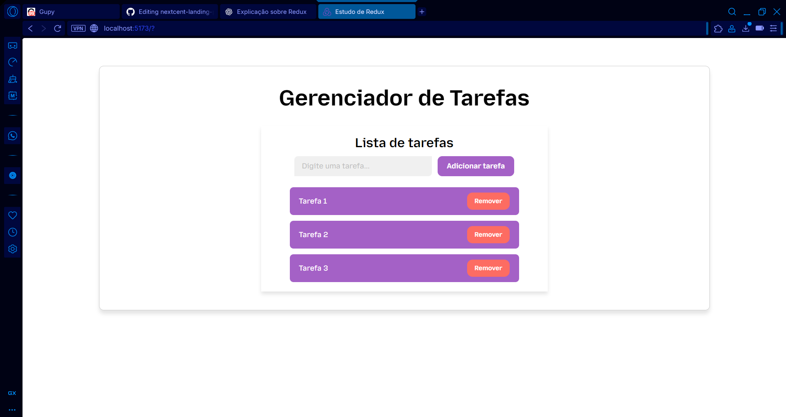

    <h1>Estudo de Redux</h1>
    

Gerenciamento de tarefas como treino para uso de Redux

<a href="#-O-que-é">O que é</a> |
<a href="#-Como-funciona">Como funciona</a> |
<a href="#-Descrição">Descrição</a> |
<a href="#-Ferramentas">Ferramentas</a> |
<a href="#-Autor">Autor</a>

****

## ❓ O que é

O Redux é uma funcionalidade JavaScript para gerenciar um estado global de uma aplicação, geralmente React.js.

****

## ⚙️ Como funciona
O Redux funciona baseado em stores, actions, reducers e dispatches. Com isso, o usuário passa uma requisição, a aplicação manda uma ação, o reducer atualiza esse estado e a UI se atualiza.

### <code>store</code>
Onde guarda os dados do estado global.

### <code>actions</code>
Ações / objetos que descrevem o que o usuário quer fazer.

### <code>reducers</code>
Cuidam da atualização do estado baseado na <code>action</code> feita.

### <code>dispatches</code>
Forma de que se envia a <code>action</code> para a <code>store</code>.

****

## 📝 Descrição

Como treino, fiz um projeto de gerenciador de tarefas, em que, ao digitar uma tarefa no <code>input</code> e clicar no botão, uma tarefa aparecerá abaixo, tendo a possibilidade de remover.

****

## 🛠️ Ferramentas 

* #### [Vite](https://vite.dev/guide)
* #### [Redux Toolkit](https://redux-toolkit.js.org)
* #### [localStorage](https://www.w3schools.com/jsref/prop_win_localstorage.asp)
* #### [CSS Modules](https://github.com/css-modules/css-modules)

****

## 👨‍💻 Autor 
 
Felipe Ferreira Lima, um estudante da área de programação.

#### 📱 Onde me encontrar 

